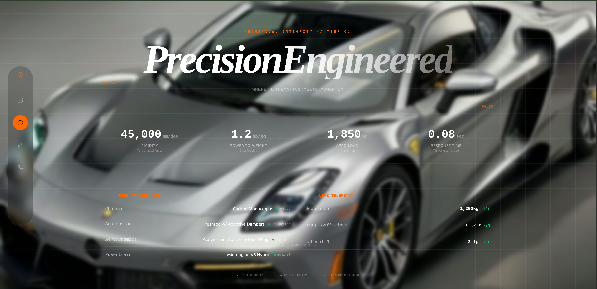
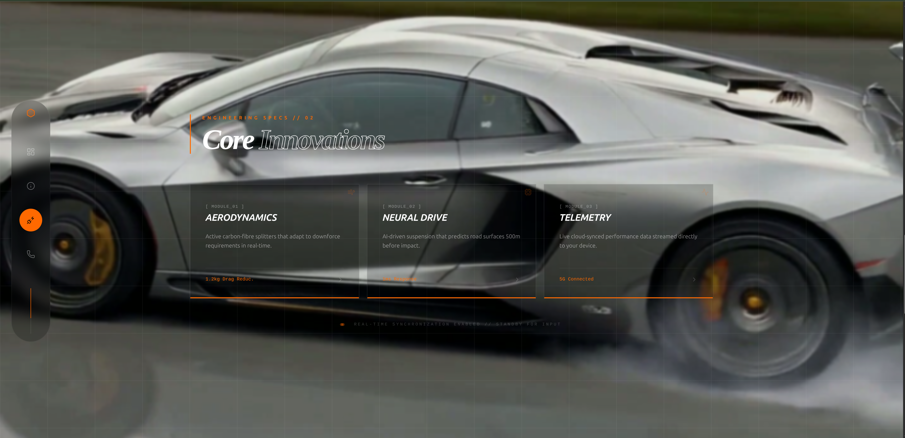
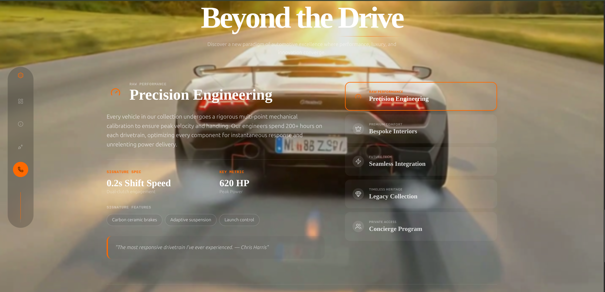
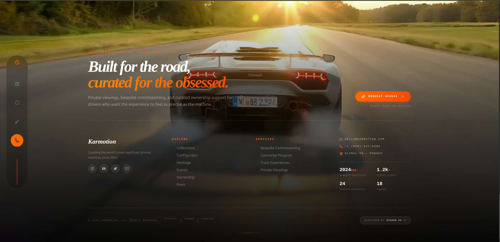

# Karmotion

Karmotion is a React + TypeScript single-page experience built with Vite.
It combines a frame-by-frame scroll animation (603 frames) with cinematic overlay sections and a compact right-edge navigation rail.

## Stack

- React 19 + TypeScript
- Vite 8
- Tailwind CSS 4
- Framer Motion
- React Router
- TanStack Query
- Vite PWA plugin

## Features

- High-performance scroll frame sequence rendered to a canvas
- Overlay sections that transition based on scroll progress
- Compact right-side navigation with scroll progress indicator
- PWA manifest and auto-update service worker registration (production)
- Path alias support (`@` -> `src`)

## Screenshots







## Getting Started

### 1. Install dependencies

```bash
npm install
```

### 2. Run development server

```bash
npm run dev
```

### 3. Build for production

```bash
npm run build
```

### 4. Preview production build

```bash
npm run preview
```

### 5. Lint

```bash
npm run lint
```

## Frame Assets

The page expects JPG frames in:

```text
public/frames/frame_0001.jpg
...
public/frames/frame_0603.jpg
```

The frame path format is:

```ts
/frames/frame_${String(i).padStart(4, "0")}.jpg
```

If frames are missing or renamed, the sequence will not render correctly.

## Project Structure

```text
src/
  components/
    Navbar.tsx
    ScrollFrameSequence.tsx
    ScrollSection.tsx
  hooks/
    use-scroll-progress.ts
  pages/
    Index.tsx
    NotFound.tsx
  sections/
    HeroSection.tsx
    EngineeredSection.tsx
    FeaturesSection.tsx
    ExperienceSection.tsx
    FooterSection.tsx
```

## PWA Notes

- PWA is configured in `vite.config.ts` using `vite-plugin-pwa`.
- In development, existing service workers and caches are explicitly cleared in `src/main.tsx` to prevent stale behavior while iterating.

## Local Host Configuration

The Vite dev server allows ngrok hosts via `server.allowedHosts`.

## License

Private project.
